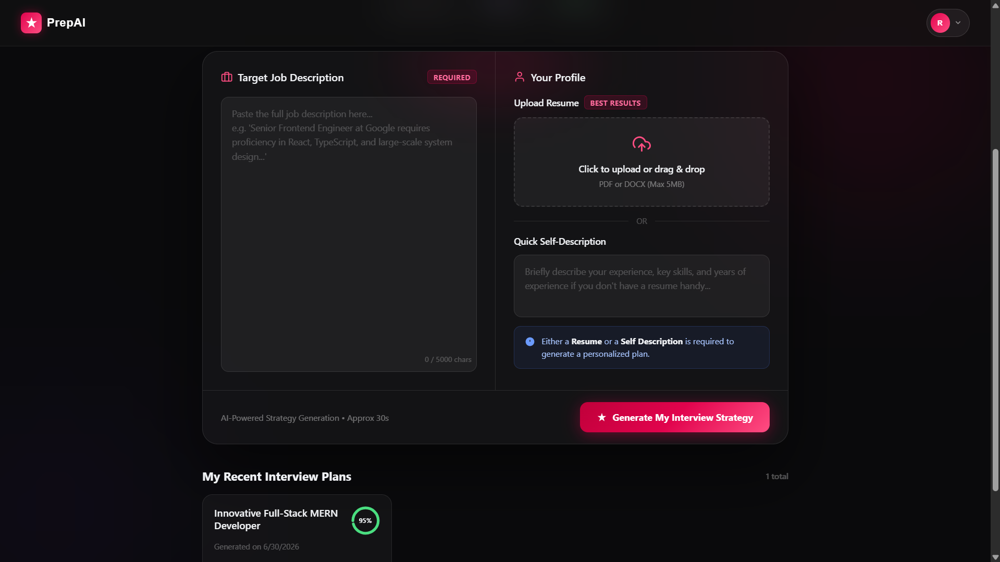
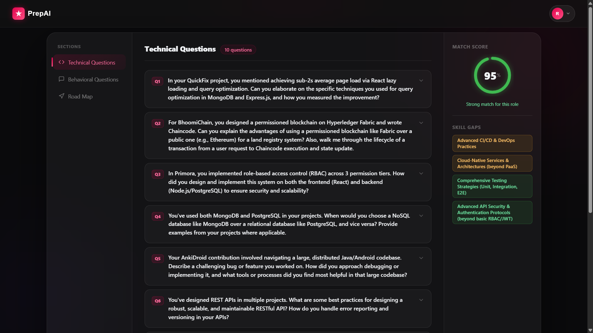
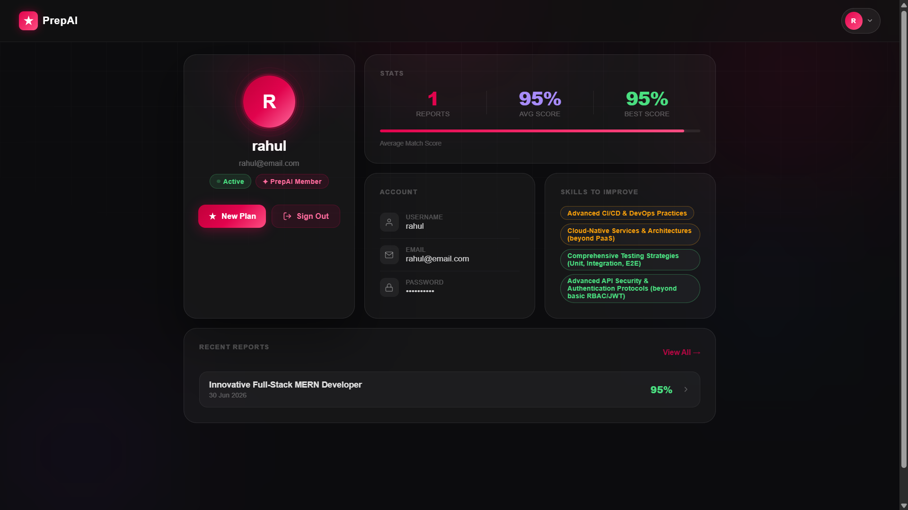

# ✦ PrepAI

**AI-Powered Interview Preparation Platform** — built with the MERN stack and Google Gemini AI.

PrepAI analyzes a job description alongside your resume (or a quick self-description) and generates a complete, personalized interview prep strategy in seconds: tailored technical and behavioral questions, a match score against the role, identified skill gaps, and a 7-day preparation roadmap.

<br/>

## 📸 Preview

| Home | Interview Plan | Profile |
|------|----------------|---------|
|  |  |  |

<br/>

## ✨ Features

- 🔐 **Secure Authentication** — JWT-based auth with bcrypt password hashing and token blacklisting on logout
- 📄 **Resume Upload** — Accepts PDF/DOCX resumes, parsed and analyzed by AI
- ✍️ **Self-Description Mode** — No resume? Describe your experience and skills instead
- 🤖 **AI-Generated Interview Plan** — Powered by Google Gemini, with automatic retry and model fallback
- 🎯 **Match Score** — See how well your profile fits the target role (0–100)
- ❓ **Tailored Questions** — 10 technical + 10 behavioral questions with intention and model answers
- 🗺️ **7-Day Roadmap** — Daily focus areas and actionable tasks to prepare
- 📊 **Skill Gap Analysis** — Highlights what to improve, ranked by severity
- 📥 **AI Resume PDF** — Generates and downloads a tailored resume as a PDF
- 👤 **Profile Dashboard** — Stats, recent reports, and skill gap overview at a glance
- 🔔 **Toast Notifications** — Real-time feedback for every action
- 📱 **Fully Responsive** — Works smoothly across desktop, tablet, and mobile

<br/>

## 🛠️ Tech Stack

**Frontend**
- React 19 + Vite
- React Router v7
- Axios
- SCSS (custom design system, glassmorphism UI)
- react-hot-toast

**Backend**
- Node.js + Express 5
- MongoDB + Mongoose
- JWT + bcrypt (authentication)
- Multer (file uploads)
- pdf-parse (resume parsing)
- html-pdf-node (PDF generation)
- Zod (AI response schema validation)

**AI**
- Google Gemini (`gemini-2.5-flash` with automatic fallback to `gemini-2.5-flash-lite`)

<br/>

## 📁 Project Structure

```
GEN-AI/
├── Backend/
│   ├── server.js
│   └── src/
│       ├── app.js
│       ├── config/          # Database connection
│       ├── controllers/     # Auth & interview logic
│       ├── middlewares/     # Auth guard, file upload handling
│       ├── model/           # Mongoose schemas
│       ├── routes/          # API routes
│       └── services/        # Gemini AI integration
│
└── Frontend/
    ├── index.html
    └── src/
        ├── components/      # Navbar, Layout
        ├── features/
        │   ├── auth/        # Login, Register, Profile, auth context
        │   └── interview/   # Home, Interview report, interview context
        └── style/           # Global SCSS
```

<br/>

## 🚀 Getting Started

### Prerequisites

- Node.js (v18+)
- MongoDB (local or Atlas)
- A Google Gemini API key — [Get one here](https://aistudio.google.com/apikey)

### 1. Clone the repository

```bash
git clone https://github.com/Lalitprajapat47/prep-ai.git
cd prep-ai
```

### 2. Backend setup

```bash
cd Backend
npm install
```

Create a `.env` file in `Backend/` with:

```env
PORT=3000
MONGODB_URI=your_mongodb_connection_string
JWT_SECRET=your_jwt_secret
GOOGLE_API_KEY=your_gemini_api_key
```

Start the server:

```bash
npm run dev
```

### 3. Frontend setup

```bash
cd Frontend
npm install
npm run dev
```

The app will be running at `http://localhost:5173`, connecting to the backend at `http://localhost:3000`.

<br/>

## 🔑 API Overview

| Method | Endpoint | Description | Access |
|--------|----------|--------------|--------|
| POST | `/api/auth/register` | Register a new user | Public |
| POST | `/api/auth/login` | Login | Public |
| GET | `/api/auth/logout` | Logout (blacklists token) | Public |
| GET | `/api/auth/get-me` | Get current logged-in user | Private |
| POST | `/api/interview/` | Generate a new interview report | Private |
| GET | `/api/interview/` | Get all reports for the user | Private |
| GET | `/api/interview/report/:id` | Get a single report by ID | Private |
| POST | `/api/interview/resume/pdf/:id` | Generate a tailored resume PDF | Private |

<br/>

## 🗺️ Roadmap

- [ ] Rate limiting on auth and AI endpoints
- [ ] Redis-based token blacklist
- [ ] Email verification on signup
- [ ] Refresh token / silent re-auth flow
- [ ] Interview practice mode (mock Q&A with feedback)

<br/>

## 📄 License

This project is for personal/educational use. Feel free to fork and build on it.

<br/>


# PrepAI

🔗 **Live Demo:** [prep-ai-navy-nine.vercel.app](https://prep-ai-navy-nine.vercel.app)

<br/> 

## 🙋 Author

**Lalit Prajapat**
[GitHub](https://github.com/Lalitprajapat47) · [LinkedIn](https://www.linkedin.com/in/lalit-prajapat-019033206/)
